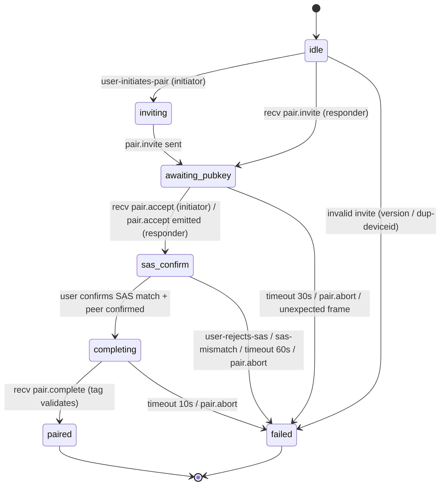

# Tether Pairing Protocol Spec (v0.1)

**Status:** Draft v0.1
**Date:** 2026-05-07
**Anchor in main spec:** `2026-04-26-tether-go-quic-design.md §11.AB`
**Implements:** D-12 pairing layer (X25519 ECDH + SAS) — referenced from §11.C / §11.J / §11.E
**Companion docs:** `2026-04-26-tether-go-quic-design.md` §3.3 (envelope wire shape), §11.C (E2E crypto), §11.D (lock state machine + audit log shape), §11.U (attach socket — the trust assumption that pairing replaces for WT clients), §11.V (transport implementation)
**Implementation status:** **Spec only.** Slice #4 implements this. Slice #3 (envelope dispatch, in flight) hardcodes a dev shared key with `TODO(pair)` markers.

## 0. Scope

Defines how two devices that have never met (e.g. user's desktop and user's phone, both intending to attach to the same daemon over WebTransport-over-HTTP/3) **establish a long-term shared cryptographic key + exchange device identities** without any prior shared secret, with active-MITM resistance during the pair window. Output of this protocol is the persistent device record consumed by §11.C envelope encryption.

**In scope:**
- Threat model
- State machine — full Mealy form, every transition named
- Frame shapes (JSON schemas) for the 5 pair frames carried over the control channel
- Short Authentication String (SAS) computation — pinned algorithm
- Transcript binding rules
- Anti-replay — per-direction strictly-monotonic ts + per-state allowed-frame matrix
- Timeouts
- Long-term key derivation
- Persistence layout (`~/.tether/users/<user>/devices/<deviceId>.json`)
- Re-pair semantics
- Multi-user forward-compat note
- `pair.abort` reason enum + JSON examples for each
- Implementation pointers (file:function) for slice #4

**Explicitly out of scope:**
- The actual wire-level mechanics of the control channel (channel-id 0x01) — see §3.3.3 of main spec
- Token issuance / refresh — D-16 / §11.J handles that *post*-pair
- Push-token integration with FCM/APNs sending — §11.E handles that, the pair frame just carries the token opaquely
- Server-side ACL — single-user (D-04) so server just routes both devices' pair envelopes by `(fromDeviceId, toDeviceId)`
- Hardware attestation, PIN reauth, biometric gating — v0.1.x at earliest

## 1. Threat model

### 1.1 What we defend against

| Adversary | Capability | Defense |
|---|---|---|
| **Passive eavesdropper** (server log scrape, on-path tap, compromised egress) | Reads ciphertext, sees envelope metadata (sessionId / deviceId / kind / nonce / ts) | X25519 ECDH — derived shared secret never crosses the wire; pair frames carry only ephemeral pubkeys |
| **Active MITM** during the pair window | Sits between A and B, swaps each side's ephemeral pubkey for its own (classic ECDH MITM) | **SAS (Short Authentication String)** + transcript binding — both endpoints independently compute a 6-char base32 code from the channel-bound transcript hash; user out-of-band compares (visual or read-and-type). MITM cannot make both sides' SAS match without breaking X25519 |
| **Replay** of recorded pair frames (e.g. server replays stored `pair.invite` to confuse device B) | Re-injects a previously-valid frame into a future pairing attempt | Strictly-monotonic ms-precision `ts` per direction + per-state allowed-frame matrix (§6); any frame outside the matching state or with `ts ≤ last-seen-ts` is rejected and triggers `pair.abort` |
| **Server fabricates a pair-completion** to a device that never paired (fake successful `pair.complete` → device thinks it's paired with the user, server has the key) | Spoofs daemon | `pair.complete` is signed under the **derived** shared key; if SAS matched, daemon and the real peer both know the same key; a fake server cannot produce a valid AEAD tag |

### 1.2 What we explicitly DO NOT defend against

- **Malicious user holding both devices** — user is the trust anchor by definition. If the user willingly pairs an attacker's device under their account, no protocol can stop that. Out of scope.
- **Device theft post-pair** — long-term key sits on disk (with OS-keychain protection for desktop, Android Keystore / iOS Secure Enclave for mobile, see §11.V). If the device is compromised, the key is compromised. Mitigation = `tether revoke <deviceId>` (D-12 / §11.C). NOT this spec's problem.
- **Compromised TLS cert chain** — pair frames travel inside WebTransport, which requires a valid TLS 1.3 cert (slice #1). If the TLS cert is forged (rogue CA, etc.) the pair window is exposed to active MITM at the **transport** layer; SAS is the second line of defense (specifically designed to survive TLS compromise during the pair window) but if both fail the user is owned. NOT this spec's problem to make TLS safer — but SAS does make it survivable.
- **Long-term forward secrecy** — long-term key is stable per device-pair until `tether revoke`. v0.1 already accepts this in D-12 / §11.C ("server-compromise confidentiality, NOT full forward secrecy"). Per-session `session_key` rotation handles forward secrecy *across cc sessions* but the device-pair `wrap_key` itself is long-lived.
- **Server-side denial of service** — server can drop pair frames silently, force timeouts, etc. The protocol handles this gracefully (failed state + abort) but does not prevent it. Out of scope; user retries.

## 2. State machine

Mealy machine. Same vibe as §11.D lock state machine — every drop / mismatch / timeout is a defined state, never silent.

**States:** `idle` | `inviting` | `awaiting-pubkey` | `sas-confirm` | `completing` | `paired` | `failed`

**Roles:** **Initiator** (the device that starts pairing — typically desktop displays QR; in fallback path, the device that types the code) and **Responder** (typically mobile that scans / receives invite). Both run the same state machine but transitions differ.

### 2.1 Transitions (initiator)

| From | Event | Guard | To | Action (frame emitted / side effect) |
|---|---|---|---|---|
| `idle` | `user-initiates-pair` | — | `inviting` | Generate ephemeral X25519 keypair `(sk_i, pk_i)`. Compose `pair.invite` (§3.1). Initialize transcript `T = []`. |
| `inviting` | `frame-sent` | invite emitted | `awaiting-pubkey` | Append `pair.invite` JSON to transcript. Start 30s timer. |
| `awaiting-pubkey` | `recv pair.accept` | frame validates (§5) | `sas-confirm` | Append `pair.accept` to transcript. Compute `shared_secret = ECDH(sk_i, pk_r)`. Compute SAS (§4). Display SAS to user. Start 60s timer. |
| `awaiting-pubkey` | `recv pair.abort` | — | `failed` | Record reason. |
| `awaiting-pubkey` | `timeout` | 30s elapsed | `failed` | Emit `pair.abort{reason: "timeout"}`. |
| `awaiting-pubkey` | `recv any other frame` | — | `failed` | Emit `pair.abort{reason: "version-incompatible"}` (or `protocol-violation`, see §6). |
| `sas-confirm` | `user-confirms-sas-match` | — | `completing` | Compute `confirm_mac = HMAC(sas_key, "initiator-confirm" \|\| transcript_hash)`. Emit `pair.sas-confirm{ok: true, mac: confirm_mac}`. Append to transcript. Start 10s timer. |
| `sas-confirm` | `user-rejects-sas` | — | `failed` | Emit `pair.abort{reason: "sas-mismatch"}`. |
| `sas-confirm` | `recv pair.sas-confirm{ok:false}` | — | `failed` | Record peer-reported SAS mismatch. |
| `sas-confirm` | `recv pair.sas-confirm{ok:true}` and we already sent ours | mac validates | `completing` | (no-op; covered by next transition) |
| `sas-confirm` | `timeout` | 60s elapsed | `failed` | Emit `pair.abort{reason: "timeout"}`. |
| `completing` | `recv pair.complete` | tag validates under derived key (§7) | `paired` | Persist device record (§8). Append audit log line. Tear down ephemeral keys from memory. |
| `completing` | `timeout` | 10s elapsed | `failed` | Emit `pair.abort{reason: "timeout"}`. |
| `completing` | `recv pair.abort` | — | `failed` | Record reason. |
| `paired` | `terminal` | — | `paired` | Steady state; protocol done. Future envelopes (§3.3 of main spec) flow under derived key. |
| `failed` | `terminal` | — | `failed` | Steady state; user must retry from `idle`. |
| (any) | `recv pair.abort` | — | `failed` | Record reason. |
| (any non-`paired`/`failed`) | `user-cancel` | — | `failed` | Emit `pair.abort{reason: "user-cancel"}`. |

### 2.2 Transitions (responder)

| From | Event | Guard | To | Action |
|---|---|---|---|---|
| `idle` | `recv pair.invite` | frame validates; protocol version compatible | `awaiting-pubkey` | Initialize transcript `T = [pair.invite]`. Generate ephemeral `(sk_r, pk_r)`. Compute `shared_secret = ECDH(sk_r, pk_i)`. Compute SAS. (Note: responder skips `inviting` state — the invite *is* the entry point.) |
| `idle` | `recv pair.invite` | version-incompatible | `failed` | Emit `pair.abort{reason: "version-incompatible"}`. |
| `idle` | `recv pair.invite` | `deviceId` collides with an already-paired record | `failed` | Emit `pair.abort{reason: "dup-deviceid"}`. |
| `awaiting-pubkey` | `frame-prepared` | accept composed | `sas-confirm` | Compose `pair.accept` (§3.2). Append to transcript. Emit. Display SAS. Start 60s timer. |
| `sas-confirm` | `user-confirms-sas-match` | — | `completing` | Emit `pair.sas-confirm{ok:true, mac: HMAC(sas_key, "responder-confirm" \|\| transcript_hash)}`. Append to transcript. Start 10s timer (waits for daemon-issued `pair.complete`). |
| `sas-confirm` | `user-rejects-sas` | — | `failed` | Emit `pair.abort{reason:"sas-mismatch"}`. |
| `sas-confirm` | `recv pair.sas-confirm{ok:true}` from peer | mac validates | (stay in `sas-confirm` until both sides have confirmed) | If both confirmed and we are server-side daemon, transition to `completing` and emit `pair.complete`. |
| `sas-confirm` | `recv pair.sas-confirm{ok:false}` from peer | — | `failed` | — |
| `completing` | `recv pair.complete` | (only daemon emits; for responder this is the path that finalizes) | `paired` | Persist device record. |
| (rest same as initiator) | | | | |

### 2.3 Diagram (mermaid)



### 2.4 Daemon's role in the state machine

The daemon (server-side) sits between initiator and responder when the path is "two devices, both attaching to the same daemon over WT" (the v0.1 default per D-21). The daemon is **NOT a pair endpoint** — both endpoints are user devices. The daemon is a **pair-aware relay**:

- The daemon recognizes `kind: "pair.*"` envelopes on the control channel and routes them by `toDeviceId` like any other envelope.
- The daemon **additionally** observes both `pair.sas-confirm` frames; once both sides have confirmed `ok:true` and their MACs validate against each other (the daemon does NOT have the `sas_key`, it only checks structural validity), the daemon emits its own `pair.complete` — this is the **server-side ack** that records the successful pair in the daemon's device registry (so the daemon knows which `deviceId` to expect on subsequent envelopes and which long-term key applies).
- The daemon's `pair.complete` is signed with the daemon's view of the long-term key, derived from the same transcript both endpoints used. If the daemon's derivation diverges from either endpoint's, the AEAD tag fails verification on the receiving endpoint → `failed`.

This means: in the v0.1 default topology there are effectively **three** state-machine actors (initiator, responder, daemon), but only two of them (the endpoints) compute the SAS and the long-term key from `shared_secret`. The daemon learns the long-term key by participating in the same key derivation **only when** both endpoints' ephemeral pubkeys are visible to it — which they are, since pair frames cross the control channel in plaintext at the envelope outer layer (the inner ciphertext is empty for pair frames; see §3).

## 3. Frame shapes

All five pair frames are carried as the **inner JSON payload** of a control-channel envelope (channel-id `0x01`, see §3.3.3 of main spec). For pair frames the envelope's `ciphertext` is **the JSON-encoded pair frame, NOT encrypted** (no shared key exists yet at frames 1-2; from frame 3 onward the body could be encrypted but is kept plaintext for transcript-hash uniformity — only the SAS-confirm `mac` field provides authentication). Envelope `kind` discriminates: `pair.invite`, `pair.accept`, `pair.sas-confirm`, `pair.complete`, `pair.abort`.

> **Naming caveat.** Because the inner payload is plaintext, the envelope's outer `keyVersion` is set to the sentinel `0` (meaning "unencrypted, pair-protocol scope") for all pair frames. Slice #4 must reject `keyVersion: 0` envelopes for any `kind` outside the `pair.*` set.

### 3.1 `pair.invite` — initiator → responder

```jsonc
{
  "type":           "pair.invite",
  "v":              1,                          // protocol version; bump on incompatible change
  "deviceId":       "device-desk-7a3f",         // proposed initiator deviceId (caller-stable)
  "ephemeralPubkey": "base64url-32B",           // X25519 ephemeral public key
  "deviceMetadata": {
    "kind":         "desktop",                  // "desktop" | "mobile"
    "model":        "MacBook Pro 14 (M2)",      // free text, displayed on responder for confirmation
    "displayName":  "Kang's MacBook",           // user-set, shown in device list later
    "osVersion":    "macOS 14.5",               // optional, free text
    "appVersion":   "tether 0.1.0-rc1"          // initiator's tether build
  },
  "ts":             1714000000000,              // sender ms-precision; receiver enforces strictly-monotonic per direction
  "nonce":          "base64url-16B"             // 16 random bytes; mixed into transcript to bind this attempt against replay across attempts
}
```

### 3.2 `pair.accept` — responder → initiator

```jsonc
{
  "type":           "pair.accept",
  "v":              1,
  "deviceId":       "device-phone-92c1",
  "ephemeralPubkey": "base64url-32B",
  "deviceMetadata": {
    "kind":         "mobile",
    "model":        "Pixel 8",
    "displayName":  "Kang's Phone",
    "osVersion":    "Android 15",
    "appVersion":   "tether 0.1.0-rc1"
  },
  "pushSubscription": {                         // optional; mobile only (desktop omits this field)
    "type":         "fcm",                      // "fcm" | "apns" — see §11.E for downstream use
    "payload":      { "token": "<FCM registration token>" }
  },
  "ts":             1714000000350,
  "nonce":          "base64url-16B"
}
```

### 3.3 `pair.sas-confirm` — both directions

```jsonc
{
  "type":   "pair.sas-confirm",
  "v":      1,
  "ok":     true,                                // false = user rejected; receiver MUST transition to failed
  "role":   "initiator",                         // "initiator" | "responder" — disambiguates the MAC label
  "mac":    "base64url-32B",                     // HMAC-SHA256(sas_key, role_label || transcript_hash). 32B output kept full
  "ts":     1714000010500
}
```

When `ok: false`, the `mac` field MAY be omitted; receiver does not validate it.

### 3.4 `pair.complete` — daemon → both endpoints (server-side ack)

```jsonc
{
  "type":           "pair.complete",
  "v":              1,
  "registeredAs": {
    "initiatorDeviceId": "device-desk-7a3f",
    "responderDeviceId": "device-phone-92c1"
  },
  "longTermKeyId":  "ltk-2026-05-07-9c3e",      // opaque daemon-assigned ID for this device-pair record
  "ts":             1714000012000,
  "nonce":          "base64url-24B",             // XChaCha20 nonce used for the AEAD tag below
  "tag":            "base64url-16B"              // XChaCha20-Poly1305.Seal(long_term_key, nonce, payload="", AD=transcript_hash || "tether-pair-complete-v1"); empty plaintext, AEAD tag only — receiver verifies tag, body of frame is the AD
}
```

Receiver verifies `tag` over `(long_term_key, nonce, "", AD = transcript_hash || "tether-pair-complete-v1")`. If verification fails → `pair.abort{reason: "cert-error"}` and transition `failed` (the term is "cert-error" loosely: "the daemon cannot prove it shares our derived key").

### 3.5 `pair.abort` — any state, any direction

```jsonc
{
  "type":   "pair.abort",
  "v":      1,
  "reason": "sas-mismatch",                      // enum below
  "detail": "user reported SAS did not match",   // free-text, optional, for logs / UI
  "ts":     1714000020000
}
```

**`reason` enum (closed set):**

| Value | Meaning |
|---|---|
| `sas-mismatch` | User indicated SAS did not match, OR peer's `pair.sas-confirm` MAC failed verification |
| `timeout` | A timer expired (per §7) |
| `user-cancel` | User explicitly canceled before reaching `paired` |
| `version-incompatible` | Received frame's `v` field does not match this implementation's supported set |
| `dup-deviceid` | Responder already has a paired record under the proposed `deviceId` and refuses (initiator MUST regenerate `deviceId` before retrying) |
| `cert-error` | `pair.complete` AEAD tag verification failed (proxy for "daemon's derived key disagrees with ours" — fatal, retry from `idle`) |
| `protocol-violation` | A frame arrived that is not allowed in the current state per the §6 matrix |

## 4. SAS computation

**Pinned algorithm.** Both sides MUST produce byte-identical SAS strings or pairing fails — a divergence here is a silent-failure bug magnet, so the algorithm is fully specified.

```
Inputs:
  shared_secret  : 32 bytes (X25519 ECDH output)
  transcript_hash: 32 bytes (SHA-256 of transcript T after pair.invite + pair.accept appended; see §5)

Step 1 — derive sas_key (also reused as MAC key in §3.3):
  sas_key = HKDF-SHA256(
              ikm  = shared_secret,
              salt = transcript_hash,
              info = "tether-sas-v1",
              L    = 32
            )

Step 2 — derive sas_bits:
  sas_bits = HKDF-SHA256(
              ikm  = sas_key,
              salt = empty,
              info = "tether-sas-display-v1",
              L    = 4   // 32 bits
            )
  Take low 30 bits: sas_30 = (uint32_BE(sas_bits) & 0x3FFFFFFF)

Step 3 — encode as 6-character base32:
  Encoding alphabet (RFC 4648 base32 minus visually-confusable chars):
    "ABCDEFGHJKLMNPQRSTUVWXYZ23456789"   // 32 chars; '0/O' and '1/I' removed (L is included)
  6 chars × 5 bits = 30 bits — encode high-to-low:
    char[0] = alphabet[(sas_30 >> 25) & 0x1F]
    char[1] = alphabet[(sas_30 >> 20) & 0x1F]
    char[2] = alphabet[(sas_30 >> 15) & 0x1F]
    char[3] = alphabet[(sas_30 >> 10) & 0x1F]
    char[4] = alphabet[(sas_30 >>  5) & 0x1F]
    char[5] = alphabet[(sas_30 >>  0) & 0x1F]

Output:
  sas_string : 6-char string, e.g. "K7QM2X"
```

**Display format (UX recommendation, not normative):** group as `K7Q-M2X` to ease human reading. Spec mandates the 6-char canonical form on the wire for tooling; the dash is a UI affordance only.

**Why 30 bits.** ~1 in 10^9 collision probability per pair attempt; matches the SAS-strength target adopted by Signal / Matrix SAS verification. 6 base32 chars is the shortest form that hits this target while staying read-aloud-able and short-typeable.

**Why the alphabet excludes 0/O/1/I.** Real-world device-name typos. SAS must be readable across screens of varying contrast / font. (NOTE: an earlier draft of this prose said "0/O/1/I/L removed", but the literal alphabet `ABCDEFGHJKLMNPQRSTUVWXYZ23456789` does include `L`. Both implementations are byte-identical with the literal alphabet; the alphabet is the source of truth.)

## 5. Transcript binding

The **transcript** `T` is an append-only ordered list of canonicalized frame bodies; `transcript_hash` is `SHA-256(canonical_concat(T))`.

**Canonicalization rule:** each frame is JSON-serialized with sorted keys, no whitespace, UTF-8 (RFC 8785 / JCS — JSON Canonicalization Scheme). Each canonical frame is length-prefixed by 4-byte big-endian when concatenated:

```
canonical_concat([f1, f2, ...]) = len32(f1_canon) || f1_canon || len32(f2_canon) || f2_canon || ...
```

**What goes into `T` and when:**

| After event | Append to `T` |
|---|---|
| `pair.invite` sent / received | The full canonical `pair.invite` body |
| `pair.accept` sent / received | The full canonical `pair.accept` body |
| `pair.sas-confirm` sent / received | The full canonical `pair.sas-confirm` body (BOTH directions) |

`pair.complete` and `pair.abort` are NOT appended; they reference `transcript_hash` as it stood after the SAS-confirm frames.

**Why this defeats active MITM.** A MITM attempting to swap pubkeys (so it shares secret-A with initiator and secret-B with responder) cannot make both endpoints' transcripts identical — each would record different `ephemeralPubkey` values from the MITM. Different transcript_hash → different `sas_key` → different SAS string → user out-of-band comparison detects the mismatch.

**Implementation note.** Both endpoints maintain `T` independently. They MUST use identical canonicalization or the SAS strings will diverge for honest peers. Slice #4 implementation MUST include a fuzz test that shuffles JSON key order on the wire and verifies `transcript_hash` is unchanged.

## 6. Anti-replay rules

### 6.1 Timestamp monotonicity (per direction)

Each endpoint maintains `last_seen_ts[peer_role]` (initialized to 0). On every received pair frame, **if** `frame.ts <= last_seen_ts[peer_role]` **then** emit `pair.abort{reason: "protocol-violation"}` and transition `failed`. Otherwise update `last_seen_ts[peer_role] = frame.ts`.

This is per-direction: the initiator tracks `last_seen_ts[responder]` and `last_seen_ts[daemon]` separately.

The 5-minute envelope-level replay window from §3.3.1 of the main spec applies on top — pair frames whose `ts` is more than 5 minutes off receiver's clock are rejected at the envelope layer before reaching the pair state machine.

### 6.2 Allowed-frame matrix (per state)

Receiving a frame whose `type` is NOT in this row's allowed set → `pair.abort{reason: "protocol-violation"}` and `failed`.

| State | Allowed inbound `type` set |
|---|---|
| `idle` (responder) | `pair.invite` |
| `idle` (initiator) | none — initiator does not receive in `idle`; this row is degenerate |
| `inviting` | `pair.abort` |
| `awaiting-pubkey` (initiator) | `pair.accept`, `pair.abort` |
| `awaiting-pubkey` (responder) | none — responder transitions through this state without external input |
| `sas-confirm` | `pair.sas-confirm`, `pair.abort` |
| `completing` | `pair.complete`, `pair.abort` |
| `paired` | none (any pair frame at this point is replay or attack) → silently drop, log warning, do NOT transition (pairing is done) |
| `failed` | none → silently drop |

### 6.3 Nonce uniqueness

Each `pair.invite` and `pair.accept` carries a 16-byte random `nonce` field that is mixed into the transcript. Two attempts by the same device with the same nonce within the same 5-minute window are treated as replay (the second attempt's transcript_hash collides with the first's, triggering downstream MAC verification mismatches).

## 7. Timeouts

| State | Timeout | On expiry |
|---|---|---|
| `awaiting-pubkey` | **30 seconds** | Emit `pair.abort{reason: "timeout"}`, transition `failed` |
| `sas-confirm` | **60 seconds** (user must look at both devices and compare / read+type) | Same |
| `completing` | **10 seconds** | Same |

Total worst-case happy-path budget: 30 + 60 + 10 = **100 seconds** from `idle` → `paired`. Actual UX-driven median expected ~15-25s.

Timers are start-on-state-entry, single-shot. Receiving a state-changing event cancels the running timer.

## 8. Long-term key derivation

After `pair.complete` is received and validated, both endpoints derive the long-term key bundle:

```
long_term_key = HKDF-SHA256(
                  ikm  = shared_secret,
                  salt = transcript_hash,
                  info = "tether-ltk-v1",
                  L    = 32
                )

transport_binding_key = HKDF-SHA256(
                  ikm  = shared_secret,
                  salt = transcript_hash,
                  info = "tether-tbk-v1",
                  L    = 32
                )
```

- `long_term_key` (32 bytes) is the input to §11.C's "device-pair `wrap_key`" — i.e. what XChaCha20-Poly1305 uses to wrap per-session `session_key`s.
- `transport_binding_key` (32 bytes) is reserved for a future channel-binding mechanism (e.g. exporter-keying-material binding to the underlying TLS session). v0.1 derives it but does NOT use it; reserving the key slot now means v0.1.x channel-binding can be added without re-pairing devices. **Open design question 1** — see §13.

After derivation, both endpoints **MUST** zeroize `shared_secret`, `sas_key`, ephemeral private keys (`sk_i` / `sk_r`), and the transcript `T` from memory. Only `long_term_key`, `transport_binding_key`, and the persisted device record (§9) survive.

## 9. Persistence layout

After successful `paired`, each endpoint writes a device record. Daemon writes the responder's record (and its own initiator record); each endpoint writes the peer's record locally as well.

### 9.1 File path

```
~/.tether/users/<user>/devices/<deviceId>.json
```

- `<user>` — v0.1 hardcoded `"default"` (D-04 single-user; see §11 below for v0.2 path)
- `<deviceId>` — the peer's `deviceId` from `pair.invite` / `pair.accept`. Filenames are constrained to `[a-zA-Z0-9-]+` (validated; reject anything else)

### 9.2 File contents

```json
{
  "v":            1,
  "deviceId":     "device-phone-92c1",
  "kind":         "mobile",
  "displayName":  "Kang's Phone",
  "model":        "Pixel 8",
  "longTermKey":  "<base64url-32B>",
  "transportBindingKey": "<base64url-32B>",
  "longTermKeyId": "ltk-2026-05-07-9c3e",
  "pushToken":    {
    "type":       "fcm",
    "payload":    { "token": "<FCM registration token>" }
  },
  "pairedAt":     "2026-05-07T14:23:11.392Z",
  "lastSeen":     "2026-05-07T14:23:11.392Z"
}
```

- `longTermKey` and `transportBindingKey` — base64url, no padding; 32 bytes each.
- `pushToken` — present only when peer `kind == "mobile"`. Format mirrors §11.E `PushSubscription`. Daemon uses this to wake mobile via FCM/APNs.
- `pairedAt` — ISO 8601 UTC, ms precision.
- `lastSeen` — daemon updates this on every successful envelope decryption from this device.

### 9.3 Permissions

- Directory `~/.tether/users/<user>/devices/` — `0700` (owner-only, no group/world)
- Each `<deviceId>.json` — `0600` (owner read/write, no other access)
- The daemon process owns this directory; other processes (CLI sub-tools, attached terminals) MUST NOT read or write files here. The CLI uses RPC to the daemon (over the existing UDS, see §11.U) to query device state.

### 9.4 Atomic write

Writes use the "write to `<file>.tmp` then `rename`" pattern to prevent torn reads if the daemon crashes mid-write. Same as §11.C `keys.json` discipline.

## 10. Re-pair semantics

A device can pair again at any time (e.g. user lost their phone, reinstalled the app, etc.). Re-pair is not silent: the audit log records it.

### 10.1 What happens on re-pair

When a `pair.invite` arrives with a `deviceId` that already has a record:

- **Default path:** the responder side returns `pair.abort{reason: "dup-deviceid"}`. The initiator must regenerate a fresh `deviceId` before retrying. This protects against accidental "re-pair my desktop with the same name" overwriting an existing key without user awareness.
- **Force-rotate path** (CLI-only, no UI in v0.1): user runs `tether pair --rotate-deviceid <existing-deviceId>` on the daemon side first. This deletes the existing device record (after a confirmation prompt), AND emits an audit log line (§10.3). Subsequent `pair.invite` with the same `deviceId` is then accepted as a fresh pair.

### 10.2 Old key fate

When a device record is replaced:

- The old `longTermKey` is zeroized in memory and the file is overwritten in place (atomic write, §9.4).
- **Per-session forward secrecy is preserved.** Past cc sessions used a per-session `session_key` derived from the old `wrap_key` (§11.C). Once the cc session ended, that `session_key` was zeroized. Re-pairing only invalidates the long-term `wrap_key`; historical session ciphertext that has already been delivered + decrypted on endpoints is unaffected. Server-stored ciphertext (catch-up queue) under the old `wrap_key` becomes undecryptable — which is the **correct** behavior: a device that re-paired SHOULD lose offline-queued envelopes from before the re-pair.
- **Audit log line:** see §10.3.

### 10.3 Audit log

Pair events are appended to `~/.tether/users/<user>/audit.log` (the file referenced in §11.D for lock events; pairing events join it for a single audit stream).

Format (one event per line, JSON):

```jsonc
{
  "ts":     "2026-05-07T14:23:11.392Z",
  "kind":   "pair.completed",                  // pair.completed | pair.aborted | pair.rotated
  "deviceId": "device-phone-92c1",
  "peerDeviceId": "device-desk-7a3f",
  "longTermKeyId": "ltk-2026-05-07-9c3e",
  "details": {                                  // kind-specific
    "transcript_hash": "<base64url-32B>"        // for pair.completed: forensic anchor
  }
}
```

For `pair.aborted` events, `details` contains `{reason, detail}` mirroring the abort frame.

For `pair.rotated` events (re-pair via force-rotate), `details` contains `{previousLongTermKeyId}`.

## 11. Multi-user implications

v0.1 is single-user (D-04). The path layout `~/.tether/users/<user>/devices/...` already namespaces by user. v0.1 hardcodes `<user> = "default"` everywhere.

**v0.2 forward-compat plan** (informative, NOT in v0.1 scope):

- `pair.invite` will gain a `userId` field (currently absent → defaults to `"default"`).
- The responder MUST validate that the `userId` matches its own user binding before accepting (a desktop logged in as `alice` rejects a `pair.invite` claiming `userId: bob`).
- Server-side daemon's device-id namespacing changes from per-process to `(userId, deviceId)` tuple.
- v0.2 protocol bumps `v: 2` in pair frames; v0.1 implementations rejecting `v: 2` with `version-incompatible` is the correct behavior at upgrade time.

No v0.1 wire-format changes are needed to make this transition smooth; the absence of `userId` is interpreted as `default`.

## 12. `pair.abort` JSON examples (one per reason)

### 12.1 `sas-mismatch`

```json
{
  "type": "pair.abort",
  "v": 1,
  "reason": "sas-mismatch",
  "detail": "user reported SAS strings did not match between devices",
  "ts": 1714000022100
}
```

### 12.2 `timeout`

```json
{
  "type": "pair.abort",
  "v": 1,
  "reason": "timeout",
  "detail": "sas-confirm timer expired after 60s",
  "ts": 1714000080000
}
```

### 12.3 `user-cancel`

```json
{
  "type": "pair.abort",
  "v": 1,
  "reason": "user-cancel",
  "detail": "user pressed cancel on initiator screen",
  "ts": 1714000005400
}
```

### 12.4 `version-incompatible`

```json
{
  "type": "pair.abort",
  "v": 1,
  "reason": "version-incompatible",
  "detail": "received pair.invite with v=2; this build supports v=1 only",
  "ts": 1714000001120
}
```

### 12.5 `dup-deviceid`

```json
{
  "type": "pair.abort",
  "v": 1,
  "reason": "dup-deviceid",
  "detail": "deviceId 'device-desk-7a3f' already paired; rotate or use a new id",
  "ts": 1714000001500
}
```

### 12.6 `cert-error`

```json
{
  "type": "pair.abort",
  "v": 1,
  "reason": "cert-error",
  "detail": "pair.complete AEAD tag verification failed; daemon-derived key mismatches local-derived key",
  "ts": 1714000012040
}
```

### 12.7 `protocol-violation`

```json
{
  "type": "pair.abort",
  "v": 1,
  "reason": "protocol-violation",
  "detail": "received pair.complete in state 'awaiting-pubkey'",
  "ts": 1714000003200
}
```

## 13. Implementation pointers

**This section is intentionally brief — slice #3 hardcodes a dev shared key with `TODO(pair)` markers; slice #4 implements this spec.** No code lives in this PR.

Suggested package layout for slice #4 inside the existing `tether` repo:

```
internal/agent/pair/
  state_machine.go       // FSM core: states, transitions, timer mgmt
  frames.go              // 5 frame structs + JSCS canonicalization helpers
  sas.go                 // SAS computation per §4 (HKDF + 30-bit base32)
  transcript.go          // Append-only transcript builder + hash
  registry.go            // Device record load / save / atomic write / 0600 perms
  audit.go               // Audit log appender (shared with internal/agent/lock)
  client.go              // Initiator-side driver: spawned by `tether pair` CLI
  server.go              // Responder + daemon-relay-side driver: lives in agent goroutine
  config.go              // Timeouts, key labels — single source of truth
```

Wire integration points:

- **Envelope dispatch (slice #3):** add a `case kind == strings.HasPrefix("pair."):` branch in the control-channel envelope handler that routes to `internal/agent/pair.Server.OnFrame(envelope)` instead of the encrypted-payload decrypt path. Slice #3 should land this dispatch with a stub `Server` that just logs + drops; slice #4 fills in the FSM.
- **CLI:** new subcommand `tether pair` (initiator) — see §11.L of main spec; this is the user-visible entry that drives `client.go`.
- **Mobile / Desktop App:** new `/pair` screen (already enumerated in §11.G route list) drives `client.go` (when initiating) or `server.go` (when scanning a QR / accepting an inbound invite).
- **Daemon:** the existing agent goroutine (`internal/agent`) gains a pair sub-goroutine that owns the device registry and routes pair envelopes to the FSM.

Test plan suggestions for slice #4:

- Unit: SAS algorithm vector tests (pin known `(shared_secret, transcript_hash) → SAS string` triples).
- Unit: JCS canonicalization fuzz — random key reordering must not change `transcript_hash`.
- Unit: FSM exhaustive transition coverage — every `(state, event)` cell exercised.
- Integration: 3-process test (initiator + responder + daemon) with simulated packet drops, replays, and a "MITM" harness that swaps `ephemeralPubkey` and verifies SAS divergence.
- Property: every `pair.abort` reason can be reached by a corresponding misbehavior.

## 14. Open design questions

These are flagged for user adjudication before slice #4 implements. None block this spec PR; all are noted inline above.

1. **`transport_binding_key` use in v0.1.x.** Currently derived but unused. Concrete plan: bind to TLS exporter-keying-material? Bind to QUIC connection-id? Bind to a per-channel HKDF expansion seeded by the WT session? Decision affects whether v0.1.x channel-binding can be added without bumping protocol `v`. **Recommendation:** decide before slice #4 freezes the on-disk file format, since adding a third derived key later means a file-format migration. **Suggested resolution:** keep the slot, leave it `null`-on-disk for v0.1, decide at v0.1.x kickoff.

2. **QR-direct-scan vs typed-SAS UX paths.** §11.C in the main spec already allows a QR-direct path (where the responder scans the initiator's QR containing `cli_pubkey + fingerprint + server_url + pairing_token + server_pubkey_pin`) AND a SAS-fallback path (where users compare a 6-char code aloud). This spec defines the **SAS path** as the universal mechanism. **Question:** does the QR-direct path bypass `pair.invite` / `pair.accept` framing entirely (the QR carries enough to derive `shared_secret` immediately), or is QR just a UX shortcut that auto-populates and auto-confirms SAS under the hood? **Recommendation:** treat QR as a UX shortcut that runs the same FSM with auto-confirmed SAS (eliminates a code path divergence). Slice #4 implements QR as `--qr` flag on `tether pair` that pre-fills frames; SAS comparison step is skipped because the QR scan IS the out-of-band channel that confirms ephemeral pubkey integrity.

3. **`deviceId` generation policy.** Spec leaves this to the caller (initiator chooses its own). Should the daemon enforce a format (e.g. `device-{kind}-{rand6}`) for human-readability in the device list? **Recommendation:** enforce regex `^device-(desktop|mobile)-[a-z0-9]{4,8}$` at the daemon's responder validator; reject malformed → `pair.abort{reason: "protocol-violation", detail: "deviceId format"}`. Adds 5 LOC, prevents user confusion later.

4. **Push-token rotation.** FCM and APNs tokens can change (app reinstall, user clears app data, OS-side rotation). Re-pairing handles this, but is there a lighter-weight `pair.update-push` flow worth specifying now? **Recommendation:** v0.1 ignore — tell user to re-pair if push stops working. Spec a `pair.update-push` frame in v0.1.x once telemetry shows token churn rate.

---

**End of pairing protocol spec v0.1.** Slice #4 implements this. Slice #3 (envelope dispatch) ships a stub `pair.*` handler and a hardcoded dev key with the TODO marker pointing here.
